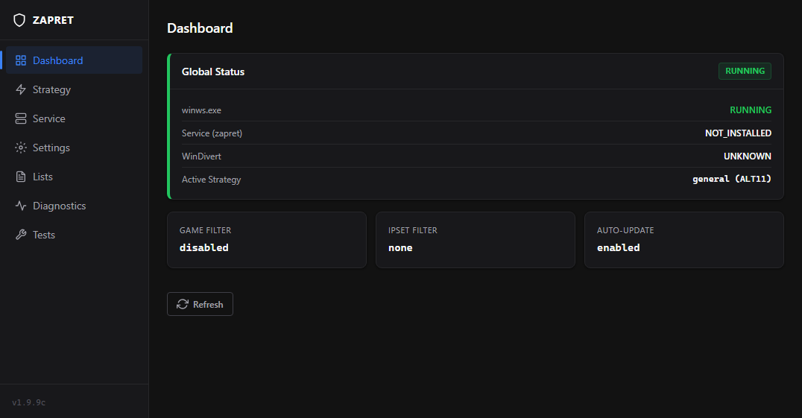
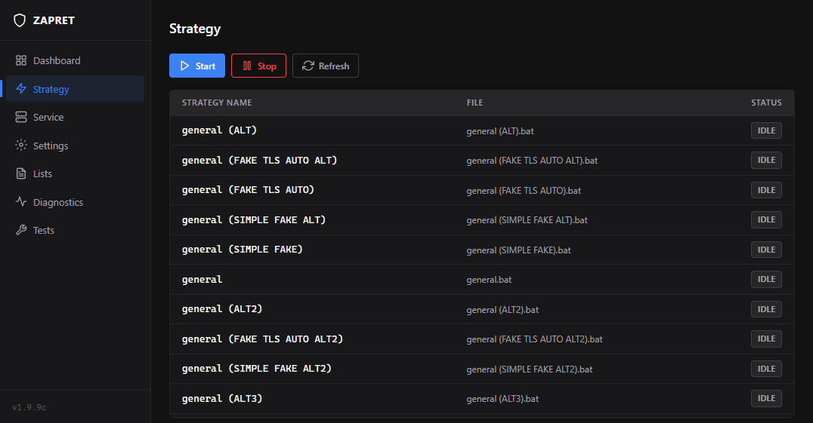
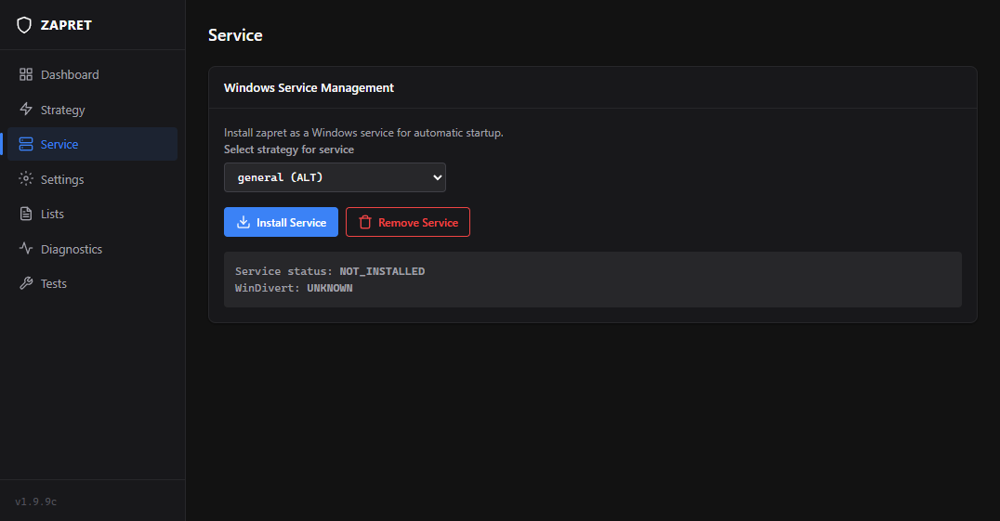
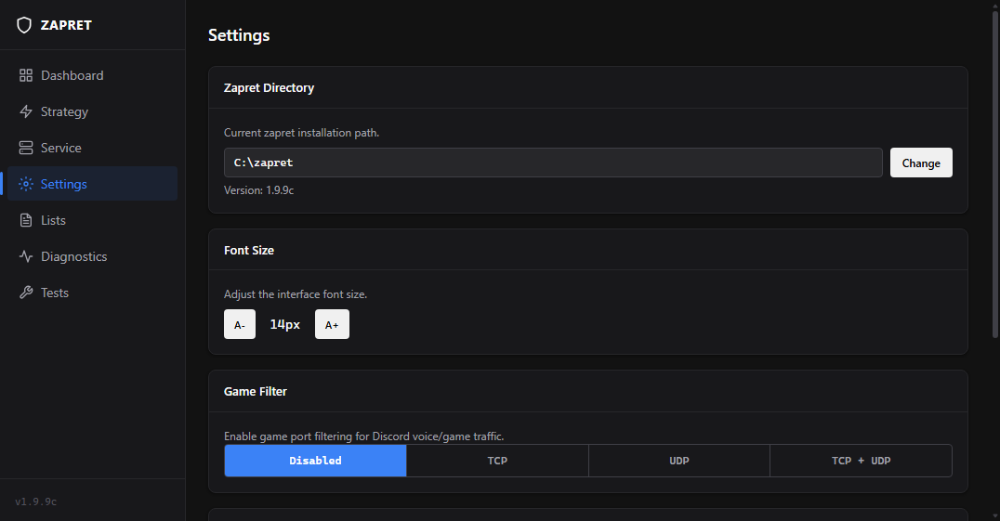
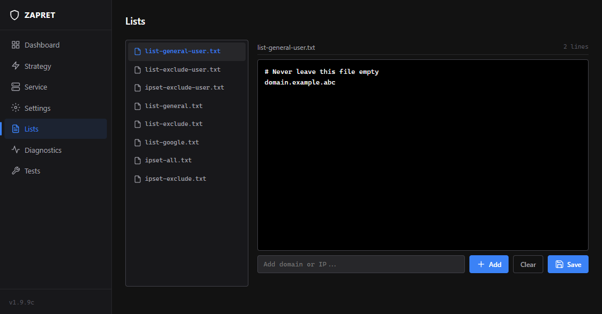
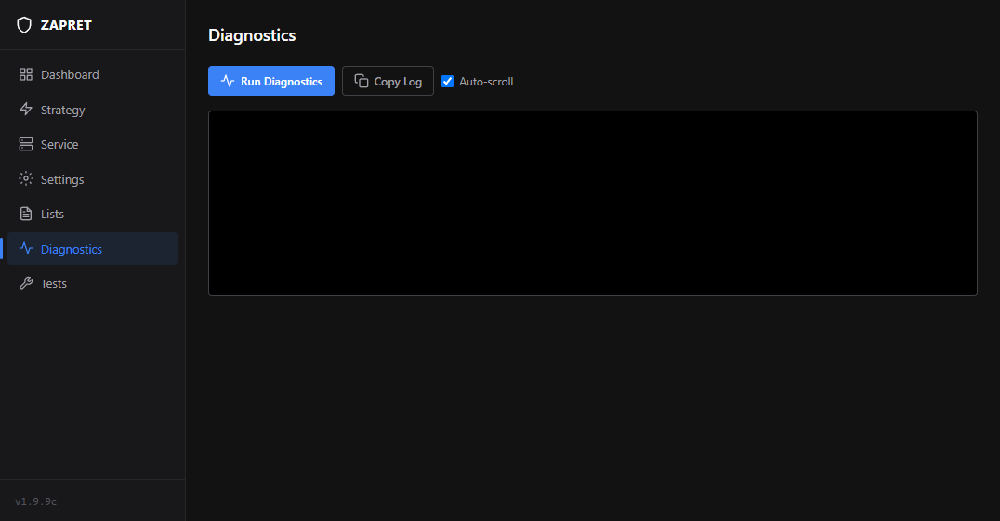
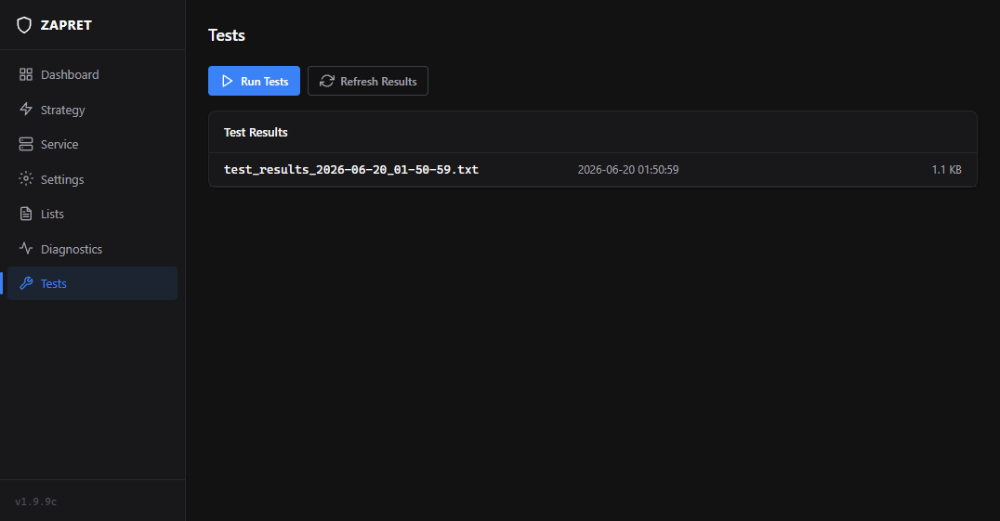

# Zapret GUI

Modern web-based interface for managing [zapret](https://github.com/Flowseal/zapret-discord-youtube) — a DPI bypass tool on Windows.

**100% Open Source.** All code is available for review — no hidden functions, no remote servers, no telemetry, no malware.

## What is this?

Zapret is a utility for bypassing Deep Packet Inspection (DPI) used by ISPs to block websites and services (Discord, YouTube, etc.). Zapret GUI is **just a wrapper** (interface) that manages the existing zapret:

- Start/stop strategy bat files
- Install/remove Windows service
- Edit domain and IP lists
- Configure zapret parameters
- Run diagnostics and tests

### What Zapret GUI is NOT:

- A virus, trojan, or spyware
- A miner or RAT tool
- A keylogger or stealer
- A VPN/proxy/tunnel service
- A program that modifies the network stack

## Code Transparency

All source code is open and available for review:

| File | Purpose |
|------|---------|
| `zapret_gui.py` | Flask server (full backend, 900 lines) |
| `templates/index.html` | HTML template (350 lines) |
| `static/style.css` | CSS styles (550 lines) |
| `static/app.js` | JavaScript client (740 lines) |

### What the .exe does

`ZapretGUI.exe` is a standard PyInstaller bundle:
- Inside: Python 3.14 + Flask + pywebview
- Edge WebView2 — a Windows system component (same engine as Edge browser)
- Flask runs a local server on `127.0.0.1:8080`
- pywebview opens a browser window without an address bar
- **No** internet access (except checking for updates on GitHub)
- **No** data collection, analytics, or telemetry
- **No** registration, login, or accounts

### What the .exe does NOT do

- Does not send data to external servers
- Does not scan the file system
- Does not track keystrokes
- Does not monitor network traffic (winws.exe does that — a zapret component, not the GUI)
- Does not change Windows settings (except zapret services)
- Does not require constant internet connection
- Does not require disabling antivirus

## Features



### Dashboard
- Global status: winws.exe running, service status, WinDivert
- Active strategy
- Game Filter, IPSet Filter, Auto-Update status

### Strategy


- List of all available strategies (bat files)
- Start/stop any strategy with one click
- Current status display (IDLE / RUNNING)

### Service


- Install zapret as a Windows service (auto-start)
- Choose strategy for the service
- Remove service

### Settings


- **Game Filter** — traffic filtering for games (TCP/UDP)
- **IPSet Filter** — IP filtering mode (none/any/loaded)
- **Auto-Update Check** — automatic update checking

### Lists


- Edit domain and IP address lists
- Built-in text editor
- Add/remove entries one by one
- Supports: list-general, list-exclude, ipset, etc.

### Diagnostics


- Automatic system check:
  - Base Filtering Engine (BFE)
  - System proxy
  - TCP timestamps
  - Conflicting programs (Adguard, Killer, SmartByte)
  - WinDivert
  - Conflicting services

### Tests


- Run zapret tests in a separate PowerShell window
- View previous test results

## Getting Started

### Via .exe (recommended)

1. Download `ZapretGUI.exe`
2. Run it with a double click
3. Done — GUI opens in a separate window

### Via Python

```bash
pip install -r requirements.txt
python zapret_gui.py
```

Or use `start.bat`.

## Requirements

- Windows 10/11
- Python 3.10+ (only for running via Python)
- Microsoft Edge WebView2 Runtime (for .exe, usually pre-installed on Windows 10/11)

## Tech Stack

- **Backend:** Python 3 + Flask
- **Frontend:** HTML + CSS + JavaScript (vanilla, no frameworks)
- **GUI:** pywebview + Edge WebView2 (Windows system component)
- **Build:** PyInstaller

## FAQ

### Is this a virus?
No. All code is open source. The .exe is built with the standard PyInstaller tool from open source code. No hidden features. You can verify the .exe on [VirusTotal](https://www.virustotal.com).

### Why is the .exe so big (~40 MB)?
Inside: Python 3.14, Flask, pywebview, Pillow, cryptographic libraries. This is normal for a Python application.

### Do I need to disable antivirus?
No. If your antivirus flags it, it's a false positive due to PyInstaller. You can verify on VirusTotal.

### Do I need internet?
Only for: downloading zapret, checking for updates, running tests. The interface itself works offline.

### What are strategy bat files?
They are zapret scripts with different DPI bypass parameters. Each bat file is a separate strategy (ALT, FAKE TLS, SIMPLE FAKE, etc.).

## License

MIT License
